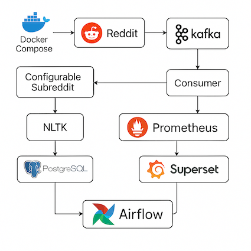
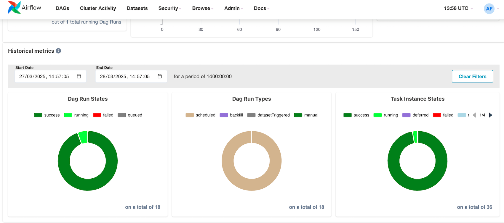
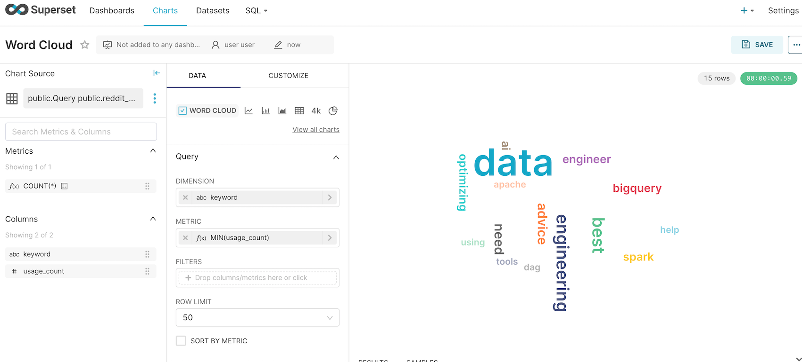

# Reddit Streaming Data Pipeline

A real-time data engineering pipeline that ingests top posts from Reddit, streams them through Kafka, enriches them with NLP, stores them in PostgreSQL, and visualizes metrics with Grafana and dashboards with Superset.

## Features

-  Fetches top Reddit posts from configurable subreddit
-  Streams to Kafka using a producer
-  Enriches data with keywords using NLTK
-  Batch inserts into PostgreSQL
-  Monitors Kafka consumer lag via Prometheus + Grafana
-  Visualizes Reddit data trends with Superset dashboards
-  Fully containerized with Docker Compose
-  Orchestrated with Airflow DAGs

 
 
 
 
 
 
